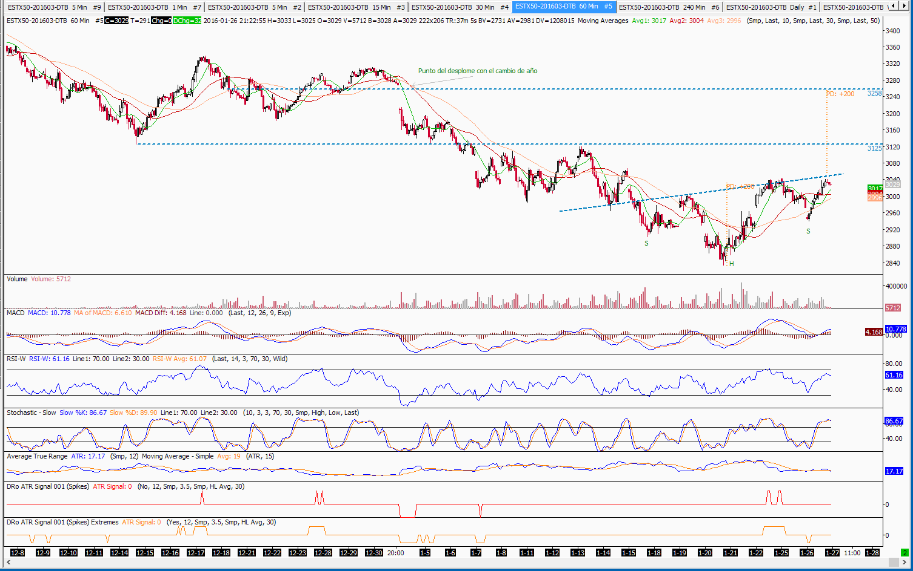

El H&S invertido
================

Estimado Mariano,

Hace unos días parecía que el mundo se acababa y para más inri el mundialmente
conocido MCI anunció en esos momentos que así era. Amén.

La prensa internacional no daba abasto con los devenires de Mariano y los
Picapiedra, los famosos Pedro y Pablo, al tiempo que tu tocayo Albert se
desmarcaba de todo pero sin recibir bola.

Y he aquí que pasados unos días de tales eventos epopéyicos, ante los cuales la
Iliada y la Odisea palidecen, las aguas parecen haberse calmado. Al final
resultará que será verdad eso que mi padre me repetía:

  *Después de la tempestad llega la calma*

Mis retahílas de días anteriores se centraban en la última palabra de dicha
verdad: *calma*. En los momentos en los que parece cundir el pánico y las
portadas de prensa se llenan de notcias sobre la bolsa y en los cuales hasta mi
madre habla de la bola, es vital mantener la *calma*.

Tanto para actuar como para no actuar.

  - No era el momento seguro de liquidar posiciones existentes llevado por el
    dolor de las pérdidas acumuladas

  - Era el momento de tomar posición si no se tenía o se quería acumular algo

Estas dos últimas afirmaciones hay que tomarlas con una pizca de sal y no
interpretarlas como algo que no son y que muchos querrían que fueran. Algo así
como:

  *Es el momento en el que la bolsa se va a dar la vuelta y se puede comprar y
  olvidarse durante años*

Mi muy modestas opinión y con ella mi evaluación de la situación dicen que
todavía hay mucho camino que hacer antes de que sea así. Si nos centramos en el
caso americano quizá incluso podría decirse que hay mucho camino que *desandar*

A tres días de que Enero, operativamente, toque a su fin parece que el mercado
europeo intenta dibujar una figura de vuelta: *Un H&S (como el champú)
invertido*.  Estas figuras son complejas y unas veces son de vuelta y otras de
continuación. Vienen a ser como el coche de San Fernando: *unas veces a pie y
otras andando*.

Al igual que pasa con las constelaciones y los dibujos borrosos de los
psiquiatras, en esos gráficos algunos aprecian esa figura de H&S (*Head &
Shoulders* u *Hombro-Cabeza-Hombro* para los amigos) y otros no.

En esa ocasión dicha figura, *invertida*, la cabeza sobresale por encima de los
hombros, pero con una peculiaridad: una gran escoliosis dado que uno de los
hombros está mucho más bajo (o alto según la perspectiva) que el otro. Y esto
que podría indicar **fuerza** para los unos, **invalida** la figura para los
otros.

Pero como no se trata de medias tintas y tampoco de alocuciones y alusiones
*zapateriles* al viento y las alianzas, allá va mi diagnóstico:

  - El *invertido* del **H&S** va a romper al alza con un objetivo de alrededor
    de 200 puntos hasta 3250-3260

    Los mismos que van aproximadamente de la punta de la cabeza al hombro más
    alto/zona de línea de cuello

  - Curiosamente ese es el punto que con el cambio de año dio lugar al desplome

    Podríamos hablar largo y tendido de por qué el mercado vuelve a esos puntos
    de aparente significancia y además de por qué se tornan en resistencia o
    soporte, pero sería una larga discusión de carácter metafísico y casi
    filosófico que puede ser dejada para mejor ocasión.

Como ya he dicho en otras ocasiones, no hay que ser más papista que el papa e
identificar números los números con mandamientos escritos a fuego en piedras
divinas.
